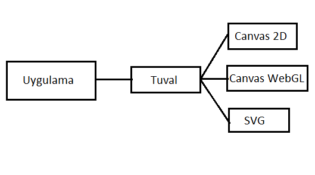

title: TGI'yı Anlamak
---

*Tuval Graphic Interface (TGI)* en basit tanımı ile HTML5 canvas, WebGL veya SVG gibi farklı çizim yüzeylerini saran bir kütüphanedir. Temel çizim fonksiyonlarını daha basit ve yapısal hale getirir. Bunun yanında bazı yardımcı nesneler sunarak (PointF, RectangleF, Color, Vector) uygulamalarınızda kolaylık ve esneklik sağlar. Aşağıdaki kod en basit haliyle ekrana bir çizgi çizer.

### Örnek
```typescript
const tg = new Tuval.Graphics(200,200);
tg.drawLine(Tuval.Pens.Green, 20, 20, 200, 200);
```
Gördüğünüz gibi ekrana birşeyler çizmek bu kadar kolay. Sadece iki satır kod ile ekrana birşeyler çizebildik. Yukarıdaki kod öncelikle 200x200 pixellik bir çizim yüzeyi oluşturur. Daha sonra bu yüzeye ön tanımlı yeşil renkli kalemle  (20,20) noktasından (200,200)  noktasına bir çizgi çizer. Çizgi kalınlığı varsayılan değer olan 1 pixeldir.



Bu bölümde Tuval Graphics tanıtılacaktır. Öncelikle, bir grafik uygulaması yazmaya başlamadan önce bilmeniz gereken Tuval Graphics'in teorik yönlerini konuşacağız.
- Tuval Graphic Interface (TGI) Nedir?
- TGI nasıl tanımlanır?
- TGI uygulamanızda nasıl kullanılır?
- TGI'daki yenilikler nelerdir?
- TGI ve klasik yöntemler arasındaki farklılıklar nelerdir?
- TGI içerisinde hangi nesneler bulunmaktadır?

Verimli ve optimize edilmiş grafik uygulamaları yazmak istiyorsanız, TGI sınıf kütüphanesini anlamak önemlidir. Bu bölümde TGI'ın nasıl tanımlandığını javascript uygulamalarında nasıl kullanılabileceğini konuşacağız.

## Tuval Graphics Nedir?
Tuval Graphic Interface (TGI), Tuval Framework içerisinde **vectorel çizimlere** odaklanmış bir yazılım kütüphanesidir.
Tüm grafik uygulamaları ister web ortamı için yazılsın, ister desktop ortamları için, bir çizim yüzeyine ihtiyaç duyar. TGI size çizim yapacağınız yüzeylerin farklılıklarını ortadan kaldırarak aynı standart api lar ile farklı yüzeylere çizim yapmanıza imkan sağlar. Aşağıdaki görsel bunu ifade etmektedir.


## Tuval Nasıl Tanımlanır ?
- *Tuval.Graphics*, web uygulamanız ile vectorel çizimlerin yapılacağı ortam arasına oturan bir bileşendir. Tuval.Graphics içerisinden verdiğiniz komutlar ilgili ortamın anlayacağı şekle dönüştürülür.
- *Tuval.Graphics* typescript kullanılarak üretilmiş javascript nesnelerin bütününe verilen isimdir. Bu dokümanda Tuval.Graphics ifadesi yerine daha kısa olan TGI (Javascript Graphic Interface) ifadesini daha sıklıkla kullanacağız.

Bu dokümanda genellikle *Tuval.Graphics* typescript ve javascript örnekleri ile kullanılacaktır.
