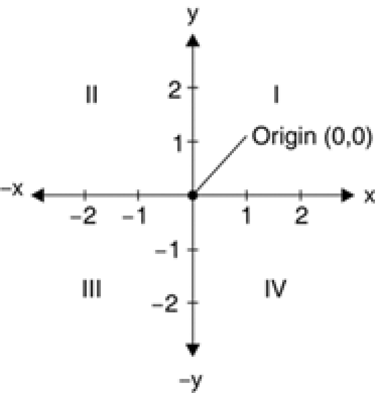
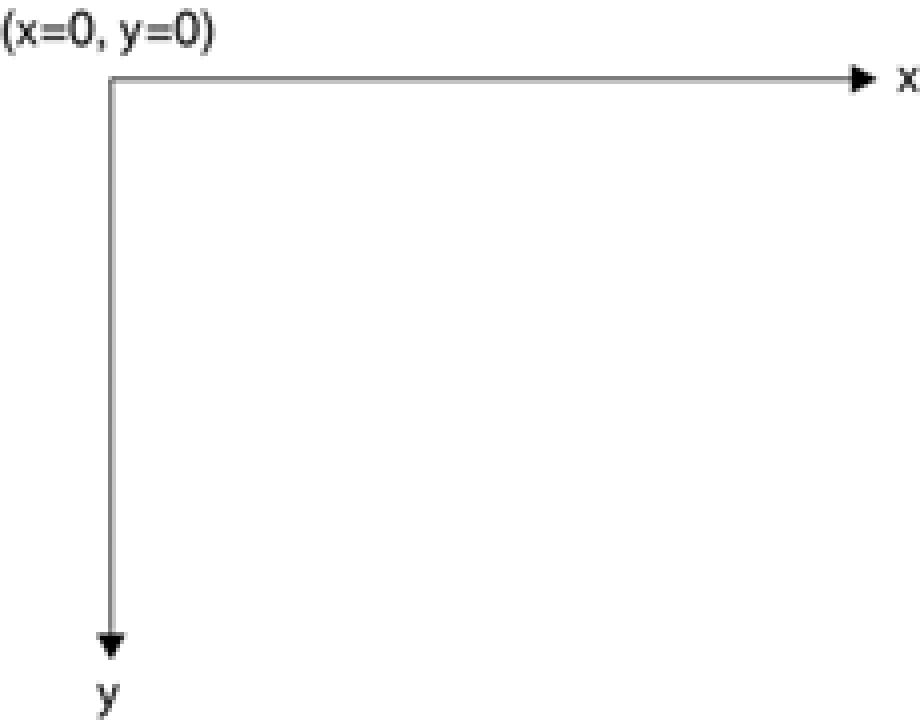

title: Koordinat Sistemi
---
Koordinat sistemini anlamak, grafik programlamanın önemli bir parçasıdır. Koordinat sistemi, monitör veya yazıcı gibi bir görüntüleme cihazındaki grafik nesnelerin pozisyonlarını temsil eder.

## Kartezyen Koordinat Sistemi
Kartezyen koordinat sistemi , iki boyutlu bir düzlemi dörtlü olarak da adlandırılan dört bölgeye ve iki eksene ayırır: x ve y. X ekseni yatay bir çizgi ve y ekseni dikey bir çizgi ile gösterilir. Verilen bir x ve y konumu çifti, bir düzlemde bir nokta tanımlar. Düzlemin orijini, x = 0 ve y = 0 değerlerine sahip bir noktadır ve kadranlar düzlemi orijine göre böler.

Hangi noktanın hangi kademeye düştüğünü bulmak için, noktanın x ve y konumlarını orijine göre karşılaştırırız.

Kademe I: x > 0 ve y > 0 
Kademe II: x < 0 ve y > 0 
Kademe III: x < 0 ve y < 0 
Kademe IV: x > 0 ve y < 0 

Pozitif x ve y değerleri olan bir nokta ikinci kademeye düşecektir. + Y ve –x olan bir nokta ikinci kademe düşecektir. –X ve –y değerlerine sahip bir nokta düşecek kademe  III’te, + x ve –y değerleri olan bir nokta kademe IV’e düşecektir. Örneğin, koordinatlardaki bir nokta (2, –3) IV. kademeye düşecek ve
koordinatlardaki bir nokta (–3, 2) II. çeyreğe düşecektir.

## TGI Koordinat Sistemi

Kartezyen koordinat sisteminden farklı olarak, varsayılan **Tuval** koordinat sistemi, sol üst köşedeki orijin ile başlar. Varsayılan olarak x ekseni sağa işaret eder ve y ekseni aşağıya işaret eder. Aşağıdaki şekilde  görüldüğü gibi, sol üst köşe x = 0 ve y = 0 puanlarıyla başlar.
x = 0, x yönündeki negatif değerlerdir ve y = 0 üzerindeki değerler y yönündeki negatif değerlerdir.

TGI koordinat sistemi, ekranın sol üst köşesinde (x = 0, y = 0) ile başladığından, varsayılan olarak yalnızca x ve y değerlerine sahip olan noktaları görebilirsiniz. –x veya –y değerlerine sahip nesneler ekranda görünmez. Bununla birlikte, negatif değerlere sahip nesneleri görünür alana taşımak için grafiksel dönüştürmeleri(translate transform) uygulayabilirsiniz.
