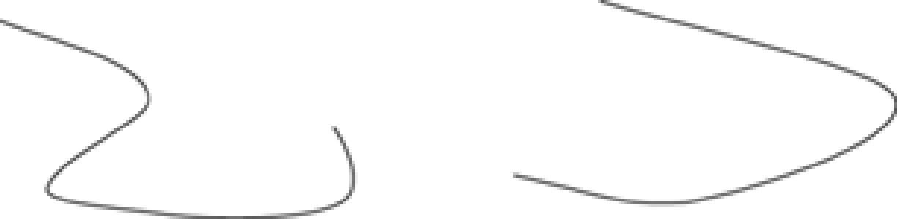
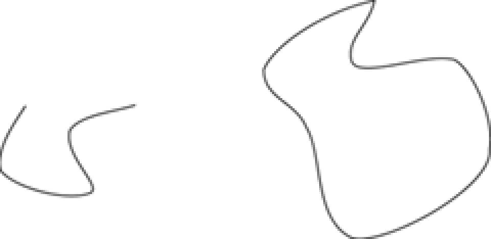

title: Eğri Çizgiler ve Eğriler Çizme
---
## drawCurve
Eğri, gerilimli bitişik noktaların bir dizisidir. Bir eğrinin gerilimi pürüzsüzlüğünü sağlar ve köşeleri kaldırır. Bir spline çoklu birleştirilmiş eğrilerin bir dizisidir. Temel olarak, bir eğride iki nokta arasında düz bir çizgi yoktur. Aşağıda iki eğri gösterilmektedir.



İki tür eğri vardır: açık ve kapalı. Kapalı bir eğri, başlangıç noktası bitiş noktası olan bir eğridir. Kapalı bir eğri olmayan bir eğriye açık eğri denir. Aşağıdaki şekilde birinci eğri açık bir eğridir ve ikinci eğri kapalı bir eğridir.



#### Açık Eğrilerin Çizilmesi
Programsal olarak, bir eğri, gerilimi olan bağlı noktaların bir dizisidir. Bir eğrinin başlangıç noktası ve bitiş noktası vardır. Bu iki nokta arasında birçok orta nokta olabilir. TG sınıfı eğriler çizmek için iki yordam sunar: drawCurve ve drawClosedCurve. drawCurve yordamı, bir dizi PointF nesnesi tarafından belirtilen bir eğri çizer. drawClosedCurve, bir dizi PointF tarafından belirtilen kapalı bir eğri çizer. drawCurve ve drawClosedCurve'ün aşırı yükleme yordamları da vardır.

drawCurve aşağıdaki aşırı yüklenmiş biçimlere sahiptir:

*Typescript*
````typescript
public drawCurve(Pen, PointF[]);
public drawCurve(Pen, PointF[], number);
public drawCurve(Pen, PointF[], number, number);
public drawCurve(Pen, PointF[], number, number, number);
````

drawCurve'ün en basit şekli;
public drawCurve(pen: Pen,  points:PointF[]): void;

Aşağıdaki örnekte kullanım şeklini göreceksiniz.
````html
<!DOCTYPE html>
<html lang="en">
<head>
    <meta charset="utf-8">
    <title>PointF</title>
   <script src="https://unpkg.com/tuval@0.0.14/tuval.js"></script>
</head>
<body>
 <script>
      var tg = new Tuval.Graphics(250 ,200);
      var bluePen = new Tuval.Pen(Tuval.Color.Blue, 2);
      var pt1 = new Tuval.PointF( 40, 50);
      var pt2 = new Tuval.PointF(50, 75);
      var pt3 = new Tuval.PointF(100, 115);
      var pt4 = new Tuval.PointF(200, 180);
      var pt5 = new Tuval.PointF(200, 90);
      var ptsArray = [ pt1, pt2, pt3, pt4, pt5];
      tg.drawCurve(bluePen, ptsArray);
  </script>
</body>
</html>
````

drawCurve'ün bu aşırı yüklenmiş versiyonu için varsayılan gerginlik 0,5'tir.
drawCurve’ün ikinci şekli aşağıdaki gibi gerginlik(tension) parametresini aldığı biçimidir.

*Typescript*
````typescript
public drawCurve(pen: Pen, points:PointF[], tension:number):void;
````
Buradaki gerginlik parametresi eğrinin şeklini belirler. Gerginlik değeri 0 ise, yordam noktalar arasında düz bir çizgi çeker. Gerginlik değeri 0 ile 1 arasında değişir.
Şimdi az önceki örneği güncelleyelim. Bir gerginlik parametrelerini ekleyelim. Aşağıdaki şekilde görünecektir.


Ayrıca ofset ekleyebilir ve eğri için bir dizi bölüm belirleyebilirsiniz:

*Typescript*
````typescript
public drawCurve( pen: Pen, points:PointF[], offset:number, numberOfSegments: number);
````
Ofset, nokta dizisinde atlanacak öğe sayısını belirtir. PointF dizisindeki atlanan öğelerden sonraki ilk öğe eğrinin başlangıç noktası olur.
NumberOfSegments özelliği, başlangıç noktasından sonra eğride çizilecek bölüm sayısını belirtir. En az 1 bölüm olmalıdır. Ofset + NumberOfSegments(parça sayısı) , PointF dizisindeki öğelerin sayısından az olmalıdır. Aksi halde yordam hata verecektir.

Aşağıdaki örnek kod, PointF dizisinin ilk öğesini atlar ve dizideki ikinci noktadan bir eğri çizmeye başlar ve üç bölümden sonra durur:

*Typescript*
````typescript
const offset: number = 1;
const segments: number = 3;
tg.drawCurve(bluePen, ptsArray, offset, segments);
````
drawCurve'ün son sürümü bir kalem, PointF dizisi, ofset, parça sayısı ve gerginlik alır:

*Typescript*
````typescript
public drawCurve(pen: Pen, points:Point[],offset: number,numberOfSegments: number, tension: float): void;
...
const offset: number = 1;
const segments:number = 3;
tg.drawCurve(bluePen, ptsArray, offset, segments, tension);
````