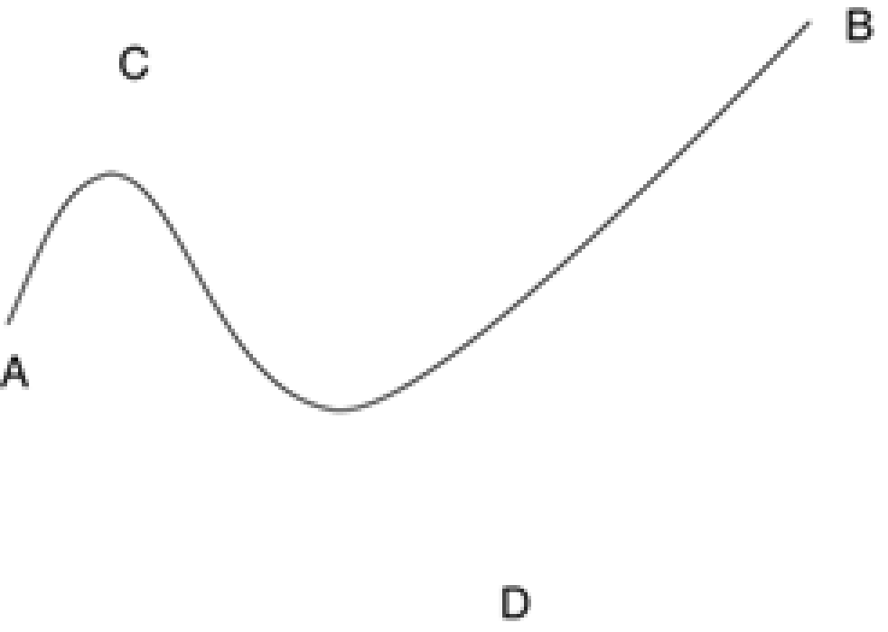

title: Bezier Eğrilerinin Çizilmesi
---
Bezier eğrileri günümüzün bilgisayar grafiklerinde sıklıkla kullanılan bir eğri çeşididir. İsmini fransız matemaktikçi Pierre Bézier'den almıştır. Pierre Bézier 1960 lı yıllarda Renault için çalışırken bilgisayar destekli tasarım araçlarında (CAD/CAM) araba parçalarının daha doğru tasarlanabilmesi adına bu eğri çeşidini geliştirmiştir. O günden bu güne bezier eğrileri bilgisayar grafiklerinde, animasyonlarda (özellikle ara değer hesaplamalarında - interpolasyon) sıklıkla kullanılmaktadır.

TGI, bezier eğrileri çizmek için  drawBezier ve drawBeziers isimli iki yordam içerir. drawBezier yordamı eğriyi çizmek için  dört noktaya ihtiyaç duyar. Birincisi başlangıç noktası, iki tanesi kontrol noktası ve bitiş noktası. Aşağıdaki örnekte (30, 30) noktasından (140, 50) nokatasına ve (80, 60) , (120, 18) kontrol noktalarına sahip olan bir bezier eğrisi çizilmiştir.

*drawBeziers* ise PointF dizisi ile belirtilen noktalardan bezier eğrileri oluşturur. Çoklu bezier eğrisi çizebilmek için x + 1 tane noktaya ihtiyacınız vardır. x burada bezier eğri sayısıdır.
