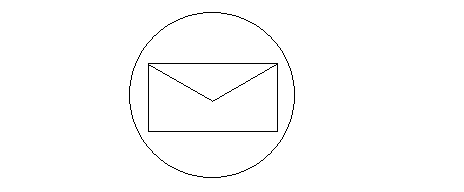

title: Grafik Yollarının (Graphics Paths) Çizilmesi
language: tr
---
Bir grafik yolu içerisinde farklı grafik şekillerini barındıran bir yapıdır. Örneğin aşağıdaki şekil elips, dikdörtgen ve iki çizgi barındırmaktadır.

Yukarıdaki şekli oluşturmak için ayrı *drawLine*, *drawRectangle* ve *drawEllipse* yordamlarını kullanabiliriz.
TGI içerisinde GraphicsPath sınıfı bu tip şekillerin çizilmesinden sorumludur. Bu sınıfın addLine, addRectangle, addEllipse, addArc, addPoygon, addCurve ve addBezier yordamları sırasıyla GraphicsPath nesnesine çizgi, dikdörtgen, elips, yay, poligon, eğri ve bezier eğrisi ekler.
Bir GraphicsPath nesnesi oluşturup içerisine şekiller ekledikten sonra onu ekrana çizmek isteriz. Bu iş için Graphics sınıfının drawPath yordamı kullanılır.
