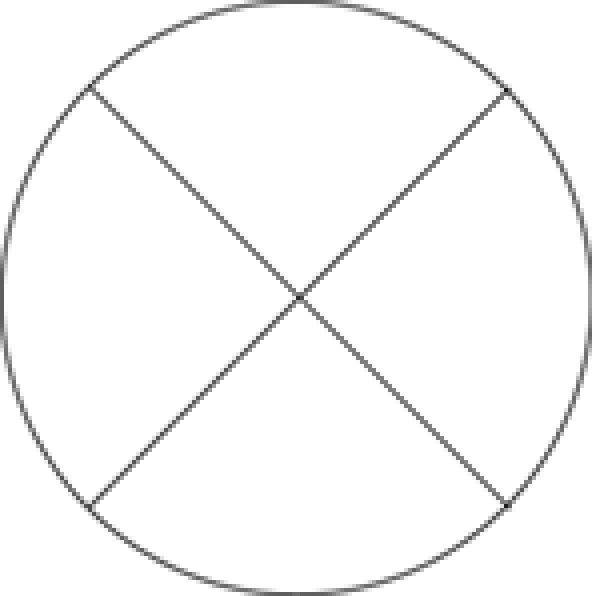

title: Elips Kesiti Şeklinin Çizilmesi
language: tr
---
Bu şekil elipsin bir dilimdir. Bir pastanın dilimine benzetebiliriz.Şekil çizilen yayın uç noktalarıyla kesişen iki radyal çizgiden oluşur. Aşağıdaki şekilde dört kesite ayrılmış bir elips gösterilmektedir.

Graphics sınıfı elipsin bir yayı tarafından belirtilen pasta dilimi şeklini çizmek için *drawPie* methodunu kullanır. *drawPie* metodu Pen nesnesi, RectangleF nesnesi ve iki radyal açı değeri alır.
