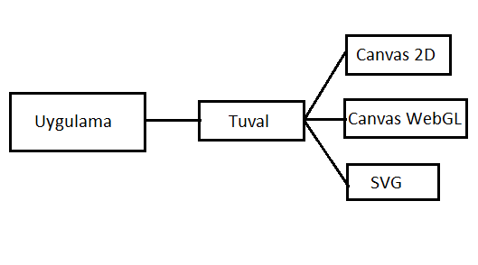

title: Understanding TGI
language: en
---
With the simplest definition of Tuval **Tuval Graphic Interface (TGI)**, is a javascript library that wraps different drawing surfaces such as Canvas 2D Context, WebGL, or SVG for making basic drawing functions simpler and more structured. Besides, it provides some helper objects (PointF, RectangleF, Color, Vector) to provide ease and flexibility in your applications. The following code most simply draws a line to the screen.

### Example
```typescript
const tg = new Tuval.Graphics(200,200);
tg.drawLine(Tuval.Pens.Green, 20, 20, 200, 200);
```
As you can see, it's so easy to draw something on the screen. With just two lines of code, we could draw something on the screen. The above code first creates a drawing surface of 200 x 200 pixels. Then draws a line to this surface from (20, 20) point to (200, 200) point with a predefined green pen. The line thickness is 1 pixel, which is the default value.


In this section we introduce to *Tuval Graphics*. Firstly, before you start writing a graphical application, we will talk about the theoretical aspects of Tuval Graphics.
- What is Tuval Graphics ?
- How to define ?
- How to use in your application ?
- What is new in Tuval Graphics ?
- TGI ve klasik yöntemler arasındaki farklılıklar nelerdir?
- TGI içerisinde hangi nesneler bulunmaktadır?

Verimli ve optimize edilmiş grafik uygulamaları yazmak istiyorsanız, TGI sınıf kütüphanesini anlamak önemlidir. Bu bölümde TGI'ın nasıl tanımlandığını javascript uygulamalarında nasıl kullanılabileceğini konuşacağız.

## Tuval Graphics Nedir?
Tuval Graphics Interface(TGI), Tuval Framework içerisinde **vectorel çizimlere** odaklanmış bir yazılım kütüphanesidir.
Tüm grafik uygulamaları ister web ortamı için yazılsın, ister desktop ortamları için, bir çizim yüzeyine ihtiyaç duyar. TGI size çizim yapacağınız yüzeylerin farklılıklarını ortadan kaldırarak aynı standart api lar ile farklı yüzeylere çizim yapmanıza imkan sağlar. Aşağıdaki görsel bunu ifade etmektedir.


## Tuval Nasıl Tanımlanır ?
- *Tuval.Graphics*, web uygulamanız ile vectorel çizimlerin yapılacağı ortam arasına oturan bir bileşendir. Tuval.Graphics içerisinden verdiğiniz komutlar ilgili ortamın anlayacağı şekle dönüştürülür.
- *Tuval.Graphics* typescript kullanılarak üretilmiş javascript nesnelerin bütününe verilen isimdir. Bu dokümanda Tuval.Graphics ifadesi yerine daha kısa olan TGI (Javascript Graphic Interface) ifadesini daha sıklıkla kullanacağız.

Bu dokümanda genellikle *Tuval.Graphics* typescript ve javascript örnekleri ile kullanılacaktır.
