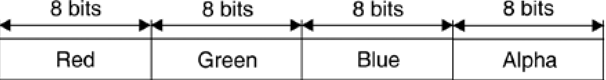

title: Drawing Surfaces
language: en
---
TGI kullanarak 2 veya 3 boyutlu çizim yapan uygulamalar temel olarak üç bileşeni kullanmaktadır. Çizim yapılacak yüzey, fırçalar ve kalemler.
* Yüzey nesnelerin çizileceği alandır. HTML5 uygulamalarında yüzey elde etmek için Graphics nesnesi kullanılır.
* Fırçalar çizilen nesnelerin arkaplanlarının boyanmasından sorumlu nesnelerdir. SolidBrush nesnenin arkaplanını seçilen renge göre boyar. Farklı fırça nesneleri ile nesnelerin arkaplaları farklı şekilde boyanabilir. Fırçalar konusunda bu nesneleri detaylandıracağız.
* Kalemler çizilen nesnelerin kenarlık biçimlerini , renlerini ve kalınlıklarını belirler. Bir nesnenin kenarlıgı düz veya kesikli bir çizgi olabileceği gibi farklı renk ve kalınlıkta da ayarlanabilir.

Grafiksel şekilleri TGI ile ekrana çizmek için nesnenin dokusunu, rengini ve gemişliğini tanımlayan bir kalem ve fırça nesnesine ihtiyaç duyar. Örneğin bir çizgi veya üçgen çizecekseniz buna uygun bir kalem nesnesi oluşturmanız gerekmektedir.

Aşağıdaki kod ekrana siyah renkte 1 pixel kalınlığında bir dikdörtgen çizecektir ve içini sarı renkle dolduracaktır. Çıktısını aşağıda görebilirsiniz.
````javascript
var tg = new Tuval.Graphics(200, 200);
tg.fillRectangle(Tuval.Pens.Yellow, 20, 20, 150, 100);
tg.drawRectangle(Tuval.Pens.Black, 20, 20, 150, 100);
````

Her çizim yüzeyinin dört ortak özelliği vardır: genişlik, yükseklik, çözünürlük ve renk derinliği.
- Bir yüzeyin genişlik ve yükseklik özellikleri, yüzeyin boyutunu belirler ve bunlar sırasıyla yatay ve dikey piksel sayısıyla belirlenir.
- Bir yüzeyin çözünürlük özelliği, grafik nesnelerinin veya görüntülerin inç başına nokta (dpi) çıkış kalitesinin bir ölçümüdür. Örneğin, 72 dpi çözünürlük, yüzeyin 1 inç'inin 72 yatay ve 72 dikey piksel tutması anlamına gelir. Monitörler ve LCD'ler için, çözünürlük, piksel yoğunluğundan ziyade yatay ve dikey toplam piksel sayısı cinsinden sıkça belirtilir. Böylece, 1280x1024'lük bir monitör çözünürlüğü, monitör ekranının 1.280 yatay piksel ve 1.024 dikey piksel tutabileceği anlamına gelir.
- Bir yüzeyin renk derinliği, her pikseli temsil etmek için kullanılan renklerin sayısıdır. HTML5 uygulamalarında renk değerinliği genellikle (255 * 255 * 255)  dir.

## Pixel Nedir?
Bir piksel, grafik nesnelerini veya görüntülerini ekranda görüntülemek için çizim işlemine katılan en küçük öğedir. Piksel yoğunluğu genellikle inç başına nokta (dpi) cinsinden bir değerle temsil edilir.

Bir pikselin kalitesi, renk derinliği ile doğrudan orantılıdır. Renk(Color) nesnesi TG 'de bir rengi temsil eder. Dört bileşene sahiptir:  kırmızı, yeşil, mavi ve alfa. Rengin RGB (kırmızı-yeşil-mavi) bileşenleri, olası renklerin sayısını temsil eder. RGB'deki her bir bileşen 256 renk kombinasyonuna sahiptir. Dolayısıyla TG de her bir Color nesnesinin üç bileşeni de 256x256x256 olası renkleri temsil eder. Alfa bileşeni, rengin diğer renklerle karışımını etkileyen rengin saydamlığını belirler.



TGI'da Renk(Color) nesnesinde tanımlanan uygun renkleri görmek için bir çizim yüzeyinin en az 24 bit renk sistemini (bir renk yapısının RGB bileşenleri için) desteklemesi gerekir; bu, yüzeyin her pikselinin 24 bit tutabilmesi gerektiği anlamına gelir (daha önce belirtildiği gibi R, G ve B bileşenleri için her biri 8 bit). Piksel başına 24 bitin altındaki yüzeyler, bir çizim uygulamasında tanımlandığı gibi grafik nesneleri ve görüntüleri tam olarak göstermeyebilir. Önümüzdeki bölümlerde renkleri daha ayrıntılı olarak ele alacağız.
