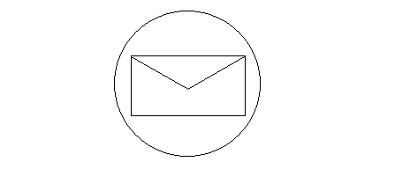

title: Drawing Graphics Paths
language: en
---
A graphics path is a combination of multiple graphics shapes, for example lines, circles, rectangles. The following figure shows this.

We can use drawLine, drawRectangle and drawEllipse methods for drawing above figure.